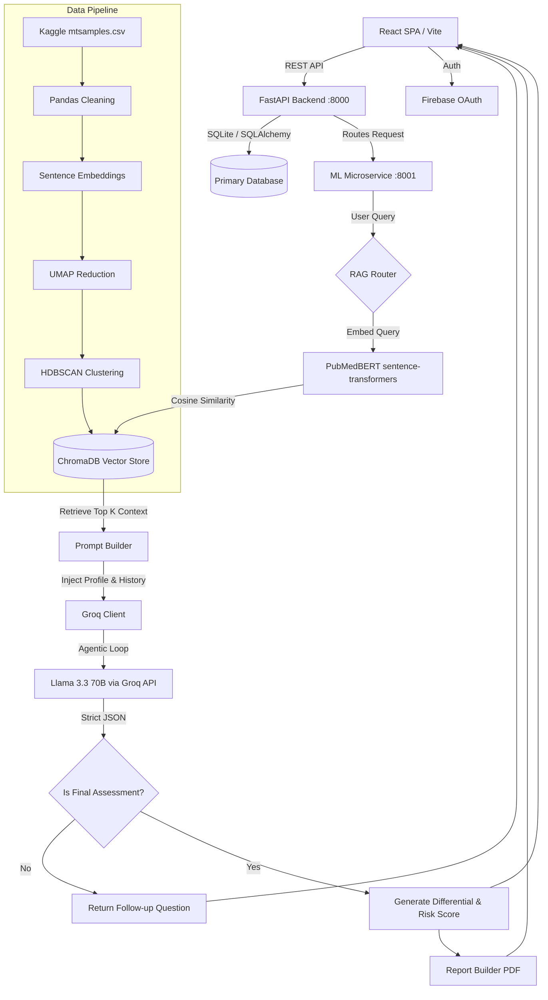

<div align="center">

<!-- BANNER — Replace with your actual banner image -->


<br/>
<br/>

<!-- PROJECT NAME + TAGLINE -->
<h1>
  
  &nbsp;EQUINOX
</h1>

<p><em>A production-grade clinical AI platform that transforms natural language symptom descriptions<br/>into structured, RAG-grounded health assessments with personalized risk stratification.</em></p>

<br/>

<!-- BADGE ROW 1 — Status & Version -->
<p>
  
  &nbsp;
  
  &nbsp;
  
  &nbsp;
  
</p>

<!-- BADGE ROW 2 — Stack -->
<p>
  
  &nbsp;
  
  &nbsp;
  
  &nbsp;
  
  &nbsp;
  
  &nbsp;
  
</p>

<!-- NAV LINKS -->
<p>
  <a href="#-what-is-this-really"><strong>Overview</strong></a> &nbsp;·&nbsp;
  <a href="#-architecture-overview"><strong>Architecture</strong></a> &nbsp;·&nbsp;
  <a href="#-getting-started"><strong>Getting Started</strong></a> &nbsp;·&nbsp;
  <a href="#-api-reference"><strong>API Docs</strong></a> &nbsp;·&nbsp;
  <a href="#-how-this-compares-to-alternatives"><strong>Comparison</strong></a>
</p>

</div>

---

<br/>

## What Is This, Really?

<table>
<tr>
<td width="60%" valign="top">

### The Core Problem

Patients struggle to articulate clinical symptoms accurately — relying on vague Google searches or fragmented symptom-checker forms that yield generic, anxiety-inducing results (e.g., "headache = brain tumor"). On the other side, healthcare providers lack time to manually parse chaotic, emotionally driven patient histories before an appointment.

Equinox bridges this gap by acting as an intelligent clinical triage layer. It accepts raw, unstructured text — exactly how a patient speaks — and translates it into a structured clinical differential.

### The Philosophy: Anti-Hallucination Architecture

What makes Equinox fundamentally different from standard "AI doctors" is its staunch **anti-hallucination architecture**. General-purpose LLMs are notoriously dangerous in medical contexts because they confidently fabricate. Equinox avoids this by entirely decoupling *knowledge retrieval* from *reasoning*.

It relies on a highly sophisticated RAG pipeline powered by `PubMedBERT` embeddings and `HDBSCAN` topological clustering of real Kaggle medical transcripts. When a user presents a symptom, Equinox semantically searches this dense vector space to retrieve **verifiable** medical context. Only after this context is retrieved is it injected into the `ClinicalMind` prompt running on `Llama 3.3 70B` via Groq. The LLM acts solely as a reasoning engine trapped strictly within the bounds of provided context.

### The Workflow

Patients interface via a dynamic React frontend. As they describe symptoms, an autonomous agentic loop takes over — asking one targeted clinical question per turn based on what data is missing from the differential (e.g., *"Does the pain radiate to your jaw?"*). It incorporates the user's longitudinal health profile and prior visit memory. Once the AI has sufficient data — or detects a critical red flag — it autonomously terminates the interview, generates a clinician-ready PDF handover report, and dynamically routes high-risk profiles to care.

</td>
<td width="40%" valign="top" align="center">

<!-- REPLACE WITH ACTUAL SCREENSHOT -->


<br/><br/>


<br/>

<br/>


</td>
</tr>
</table>

<br/>

---

## Features

<table>
<tr>
<td width="50%" valign="top">

**Free-Text Clinical Intake**
Natural language processing of raw patient narratives into structured clinical entities (Site, Onset, Character, Radiation, etc.) via the SOCRATES framework.

**Dynamic NLP Interviewing**
Sovereign AI agent that drives the assessment, autonomously asking targeted follow-up questions to narrow down the differential diagnosis without human intervention.

**RAG-Grounded Medical Knowledge**
Retrieval-Augmented Generation using `PubMedBERT` embeddings and `ChromaDB`, grounding all LLM reasoning strictly in retrieved medical datasets and Kaggle transcripts.

**HDBSCAN Semantic Clustering**
Advanced topological data analysis to cluster medical transcriptions and map symptoms efficiently, drastically improving retrieval speed and contextual accuracy.

**Personalized Risk Stratification**
Programmatic cross-referencing of current symptoms with the user's stored health profile (medications, allergies, past conditions) to assign a calibrated risk tier: `Low` · `Moderate` · `High` · `Critical`.

</td>
<td width="50%" valign="top">

**Automated Clinical Handover PCRs**
Generation of comprehensive, physician-centric PDF reports using ReportLab, fully structured with differentials, vital heuristics, and red flag tracking.

**Autonomous Emergency Detection**
Built-in heuristic safeguards combined with LLM analysis that immediately force-terminate an assessment and escalate to `CRITICAL` care protocols upon detecting hemodynamic, neurologic, or severe pain red flags.

**Voice Interactivity**
Integration with `Vapi` for AI voice agents and `Edge TTS` for realtime text-to-speech feedback during the symptom extraction interview.

**Emotional Distress Tone Analysis**
Automatic detection of patient panic, frustration, or anxiety based on syntactic input, dynamically triggering warm wellness nudges and shifting the AI tone.

**Memory & Context Continuity**
Longitudinal session tracking that natively injects past patient medical visits into the live Llama 3 context window for continuity of care.

</td>
</tr>
</table>

<br/>

---

## Screenshots

<div align="center">

> Replace the placeholders below with actual screenshots of your application.

<table>
<tr>
<td align="center" width="33%">

<br/><sub><b>Clinical Intake Interface</b></sub>
</td>
<td align="center" width="33%">

<br/><sub><b>Risk Stratification Output</b></sub>
</td>
<td align="center" width="33%">

<br/><sub><b>Clinician Handover PDF</b></sub>
</td>
</tr>
</table>

</div>

<br/>

---

## How This Compares to Alternatives

<div align="center">

| Feature / Aspect | **Equinox** | Ada Health | Healthify Me | WebMD | K Health |
|:---|:---:|:---:|:---:|:---:|:---:|
| AI Model Type | `Llama 3.3 70B` + `PubMedBERT` | Proprietary Bayesian | Basic ML / Rules | Heuristic Tree | Text-based ML |
| Data Source | Kaggle Transcripts + Guidelines | Internal Curated DB | Nutrition/Fitness DB | Static Articles | Mayo Clinic Data |
| Personalization | **High** (Longitudinal Memory) | Moderate | Moderate (Fitness) | Low | Moderate |
| Offline Capability | Limited (requires API) | Unknown | Limited | Yes (basic) | Limited |
| Open-Source | **Yes** | No | No | No | No |
| Cost | **Free** | Freemium | Paid | Free (ad-supported) | Paid per visit |
| RAG / Retrieval | **Yes** (`ChromaDB` vector search) | No | No | No | No |
| Clinical Accuracy Focus | RAG-Bounded Generation | Very High (validated) | Low (non-clinical) | Moderate | High |
| NLP Depth | **Semantic Clustering** (`HDBSCAN`) | Keyword / Probabilistic | Basic intent | Keyword matching | Keyword / Intent |
| Agentic Interview Loop | **Yes** | No | No | No | No |
| PDF Clinical Reports | **Yes** | No | No | No | No |
| Voice Interactivity | **Yes** (Vapi + Edge TTS) | No | No | No | No |

</div>

<br/>

---

## Architecture Overview

### System Flow



<br/>

### Layer Breakdown

<table>
<tr>
<th width="20%">Layer</th>
<th>Description</th>
</tr>
<tr>
<td><strong>Frontend</strong></td>
<td>React 18 SPA built with Vite. State managed by Zustand. Animations via Framer Motion and Three.js (react-three-fiber) — particle backgrounds and fluid cursors. Communicates with the backend over Axios at <code>/api</code>.</td>
</tr>
<tr>
<td><strong>Backend</strong></td>
<td>FastAPI on Python 3.11, port <code>8000</code>. Handles authentication (PyJWT + Firebase OAuth), session management, appointments, and feedback. Persistence via SQLite + SQLAlchemy ORM, validated through Pydantic.</td>
</tr>
<tr>
<td><strong>ML Microservice</strong></td>
<td>Secondary FastAPI service on port <code>8001</code>. Runs the full RAG pipeline: query embedding → ChromaDB retrieval → prompt construction → Groq agentic call → structured JSON extraction.</td>
</tr>
<tr>
<td><strong>Vector Store</strong></td>
<td>ChromaDB as the persistent semantic layer. Documents embedded via <code>NeuML/pubmedbert-base-embeddings</code>. Stores chunked JSON guidelines covering differential diagnoses, risk factors, and recommended actions.</td>
</tr>
<tr>
<td><strong>Data Pipeline</strong></td>
<td><code>mtsamples.csv</code> from Kaggle is cleaned via pandas, embedded with PubMedBERT, reduced to 2D using UMAP, and topologically clustered using HDBSCAN to identify natural symptom syndromes before insertion into ChromaDB.</td>
</tr>
<tr>
<td><strong>Agentic Loop</strong></td>
<td>The LLM controls its own termination. By setting <code>"is_final": true</code> in its strictly enforced JSON schema, the model transitions app state from "Interviewing" to "Assessment Complete" — acting as a state machine controller.</td>
</tr>
</table>

<br/>

---

## Tech Stack

<div align="center">

| Technology | Category | Why It's Used |
|:---|:---:|:---|
| `React 18` + `Vite` | Frontend | Fast HMR, SPA routing, component architecture |
| `Zustand` | State Management | Lightweight, boilerplate-free global state |
| `Framer Motion` + `Three.js` | UI / Animations | Premium fluid animations and 3D particle scenes |
| `FastAPI` | Backend Framework | Async Python server with automatic OpenAPI docs |
| `SQLAlchemy` + `SQLite` | ORM / Database | Simple, file-based relational persistence |
| `Pydantic` | Validation | Runtime type safety for all API contracts |
| `PyJWT` + `Firebase OAuth` | Auth | Stateless JWT session + Google sign-in |
| `Groq API` | LLM Inference | Ultra-fast Llama 3.3 70B inference (sub-second) |
| `Llama 3.3 70B` | Language Model | High-reasoning open model for clinical differential |
| `PubMedBERT` (`NeuML`) | Embedding Model | Fine-tuned on biomedical text; superior medical NLP |
| `ChromaDB` | Vector Database | Local-first persistent vector store for RAG |
| `HDBSCAN` | Clustering | Density-based; handles medical transcript noise well |
| `UMAP` | Dimensionality Reduction | Topology-preserving 2D projection for clustering |
| `sentence-transformers` | Embedding Framework | Loads and runs PubMedBERT in the pipeline |
| `pandas` | Data Processing | Cleans and preprocesses Kaggle CSV transcripts |
| `ReportLab` | PDF Generation | Programmatic clinical PDF report rendering |
| `Vapi` | Voice AI | AI voice agent infrastructure for spoken intake |
| `Edge TTS` | Text-to-Speech | Real-time synthesized speech output |
| `Axios` | HTTP Client | Frontend-to-backend REST communication |

</div>

<br/>

---

## Getting Started

### Prerequisites

<p>

&nbsp;

&nbsp;

&nbsp;

&nbsp;

</p>

---

### Step 1 — Clone the Repository

```bash
git clone https://github.com/quirky-sharan/equinox.git
cd equinox
```

---

### Step 2 — Frontend Setup

```bash
cd frontend
npm install
```

Create `frontend/.env`:

```env
VITE_FIREBASE_API_KEY=your_key_here
VITE_FIREBASE_AUTH_DOMAIN=your_project.firebaseapp.com
VITE_FIREBASE_PROJECT_ID=your_project_id
VITE_API_BASE_URL=http://localhost:8000
```

---

### Step 3 — Backend Setup

```bash
cd ../backend
pip install -r requirements.txt
```

Create `backend/.env`:

```env
DATABASE_URL=sqlite:///./meowmeow.db
JWT_SECRET=super-secret-production-key-change-me
JWT_ALGORITHM=HS256
ACCESS_TOKEN_EXPIRE_MINUTES=1440
ML_SERVICE_URL=http://localhost:8001
FIREBASE_PROJECT_ID=your_project_id
FIREBASE_API_KEY=your_key
FRONTEND_URL=http://localhost:5173
GROQ_API_KEY=gsk_your_groq_api_key_here
VAPI_API_KEY=your_vapi_key
VAPI_PHONE_NUMBER_ID=your_vapi_phone_id
```

---

### Step 4 — ML Service Setup & Vector DB Ingestion

```bash
cd ../ml
pip install -r requirements.txt
```

> **Important:** Run the ingestion script **once** to build your local ChromaDB vector index from the medical knowledge base.

```bash
python -m knowledge_base.ingest
```

> On first run, `SentenceTransformer` and `PubMedBERT` weights will be downloaded automatically. This may take a few minutes.

---

### Step 5 — Launch All Services

From the root directory, run the initialization script:

```bat
start_all.bat
```

This boots all three services in parallel:

| Service | URL |
|:---|:---:|
| Frontend UI (Vite / React) | `http://localhost:5173` |
| Backend API (FastAPI) | `http://localhost:8000` |
| ML Engine (FastAPI) | `http://localhost:8001` |

---

### Step 6 — Verify It's Running

- Open `http://localhost:5173` — you should see the Equinox landing page.
- Navigate to `/api/docs` (port 8000) for the auto-generated FastAPI Swagger UI.
- Navigate to `http://localhost:8001/docs` for the ML service API docs.
- Sign in with Google, start a new session, and describe a symptom to confirm the agentic loop is responding.

<br/>

---

## Folder Structure

```
equinox/
│
├── backend/                       # Primary FastAPI application (port 8000)
│   ├── .env                       # Backend environment secrets (DB, JWT, Firebase)
│   ├── auth.py                    # PyJWT issuance and validation logic
│   ├── config.py                  # Pydantic BaseSettings mapping .env to runtime config
│   ├── database.py                # SQLAlchemy engine initialization and session factory
│   ├── main.py                    # Application entrypoint & CORS middleware setup
│   ├── requirements.txt           # Python dependencies for the backend
│   ├── models/                    # SQLAlchemy ORM models (users, sessions, telemetry)
│   ├── routes/                    # Route handlers mapping URL paths to modules
│   └── schemas/                   # Pydantic serializers for request/response validation
│
├── frontend/                      # React 18 SPA (Vite, port 5173)
│   ├── package.json               # NPM dependency registry
│   ├── vite.config.js             # HMR server + /api reverse proxy config
│   └── src/
│       ├── App.jsx                # Root component and React Router orchestrator
│       ├── main.jsx               # HTML entry point attaching the React tree
│       ├── index.css              # Global token and styling definitions
│       ├── api/                   # Axios sub-clients for FastAPI communication
│       ├── components/            # Isolated UI parts (Navbars, Cursors, 3D elements)
│       ├── config/                # Frontend environment and key config
│       ├── hooks/                 # Custom hooks (cursor state, session, etc.)
│       ├── pages/                 # Full-screen route targets (individual pages)
│       ├── store/                 # Zustand global state configuration
│       └── utils/                 # Extracted helper and utility scripts
│
├── medical_system/                # Clinical data aggregation workflow
│   ├── data_pipeline.py           # Pandas driver for cleaning Kaggle datasets
│   ├── main.py                    # Executor triggering pipeline flow and DB insertion
│   ├── pdf_report_generator.py    # ReportLab script rendering clinical PDF summaries
│   └── rag_engine.py              # HDBSCAN clustering engine for embedding topologies
│
├── ml/                            # AI/ML inference microservice (port 8001)
│   ├── groq_client.py             # Agentic loop managing Llama 3 context and termination
│   ├── ml_api.py                  # FastAPI routes for chat generation and TTS streams
│   ├── prompt_builder.py          # Combines RAG context, profile, and SOCRATES format
│   ├── report_generator.py        # Connects ML outputs to PDF builders
│   ├── session_manager.py         # In-memory conversation history dictionary
│   ├── user_memory_injector.py    # Maps SQL user history into live LLM context
│   ├── chroma_db/                 # ChromaDB persistent vector store files
│   └── knowledge_base/
│       ├── ingest.py              # SentenceTransformer embedding push to ChromaDB
│       ├── retriever.py           # Query embedding and nearest-neighbor retrieval
│       └── medical_knowledge*.json# Static structured condition definitions for differential matching
│
├── README.md                      # This file
└── start_all.bat                  # Sequential boot script for all services
```

<br/>

---

## API Reference

### Backend — Port `8000`

<table>
<tr><th>Method</th><th>Endpoint</th><th>Description</th></tr>
<tr>
<td></td>
<td><code>/api/session/new</code></td>
<td>Instantiate a new patient encounter session</td>
</tr>
<tr>
<td></td>
<td><code>/api/history</code></td>
<td>Return all past user assessment logs</td>
</tr>
<tr>
<td></td>
<td><code>/api/auth/verify</code></td>
<td>Validate Firebase OAuth tokens and issue JWT</td>
</tr>
</table>

### ML Engine — Port `8001`

<table>
<tr><th>Method</th><th>Endpoint</th><th>Description</th></tr>
<tr>
<td></td>
<td><code>/ml/chat</code></td>
<td>Main RAG pipeline — triggers Groq call, returns risk tiers and follow-up or final differential</td>
</tr>
<tr>
<td></td>
<td><code>/ml/report/pdf</code></td>
<td>Generate the post-assessment clinician PCR Handover PDF</td>
</tr>
<tr>
<td></td>
<td><code>/ml/speak</code></td>
<td>Stream Edge TTS voice synthesis audio data</td>
</tr>
</table>

> Full interactive API docs are auto-generated by FastAPI and available at `/docs` on both ports when the servers are running.

<br/>

---

## Data Sources

<table>
<tr>
<td width="50%" valign="top">

### Kaggle — `mtsamples.csv`

The primary training and retrieval corpus. Contains thousands of real de-identified medical transcription samples across specialties. Used in the data pipeline to:

1. Clean and chunk transcripts via `pandas`
2. Generate dense embeddings using `PubMedBERT`
3. Reduce to 2D via `UMAP`
4. Cluster into symptom syndromes using `HDBSCAN`
5. Insert into `ChromaDB` for vector retrieval

**Source:** [Kaggle — Medical Transcriptions](https://www.kaggle.com/datasets/tboyle10/medicaltranscriptions)

</td>
<td width="50%" valign="top">

### Static Medical Knowledge Base

A curated set of `medical_knowledge*.json` files in `ml/knowledge_base/` that define structured differential diagnosis mappings, risk factors, and recommended actions for known condition clusters.

These are embedded alongside the Kaggle transcripts and serve as the authoritative clinical ground truth for the retrieval layer.

**Format:** Chunked JSON — each document represents a condition cluster with associated symptoms, red flags, and differential guidance.

</td>
</tr>
</table>

<br/>

---

## Contributors

<div align="center">

<table>
<tr>
<td align="center" width="33%">
<br/>
<strong>Sharan</strong><br/>
<sub>AI / ML Pipeline · NLP Engineering · Frontend Architecture</sub>
</td>
<td align="center" width="33%">
<br/>
<strong>Devatman</strong><br/>
<sub>Frontend UI/UX · Backend APIs · Three.js · Database</sub>
</td>
<td align="center" width="33%">
<br/>
<strong>Varun</strong><br/>
<sub>Agentic Call Base · Agent Autonomy · Frontend Features</sub>
</td>
</tr>
</table>

</div>

<br/>

---

## Acknowledgements

- **[PubMedBERT](https://huggingface.co/NeuML/pubmedbert-base-embeddings)** by NeuML — biomedical embedding model
- **[Groq](https://groq.com)** — ultra-fast LLM inference infrastructure
- **[ChromaDB](https://www.trychroma.com)** — open-source vector database
- **[Kaggle — Medical Transcriptions](https://www.kaggle.com/datasets/tboyle10/medicaltranscriptions)** — primary clinical corpus
- **[Vapi](https://vapi.ai)** — voice AI infrastructure
- **[ReportLab](https://www.reportlab.com)** — PDF generation library

<br/>

---

<div align="center">


<br/><br/>

<sub>

**Medical Disclaimer:** Equinox is an AI research tool strictly intended for educational demonstration purposes.<br/>
It is **not** a diagnostic medical device and its outputs must never supersede professional clinical judgment.

</sub>

<br/>

<sub>Made with precision by the Equinox team.</sub>

</div>
