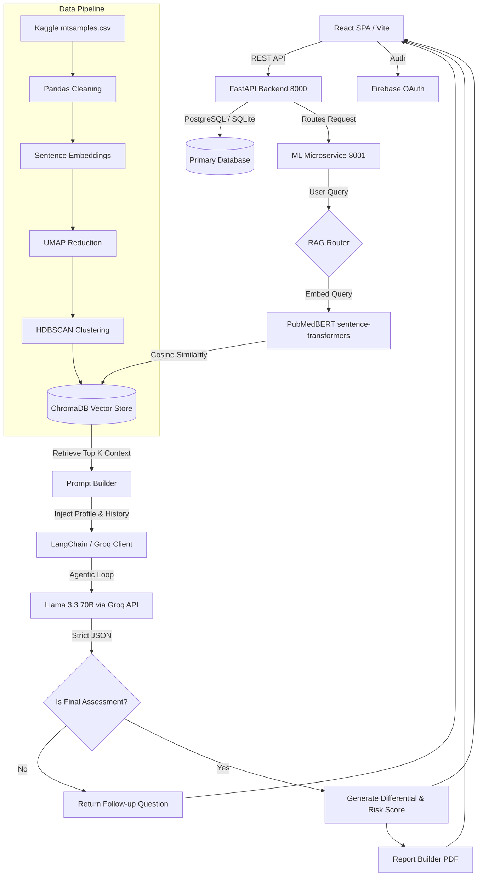

# Equinox
> A production-grade clinical AI platform that transforms natural language symptom descriptions into highly structured, RAG-grounded health assessments with personalized risk stratification.

---

## 🧠 What Is This, Really?

**The Core Problem**
Patients struggle to articulate clinical symptoms accurately, often relying on vague Google searches or fragmented symptom-checker forms that yield generic, anxiety-inducing results (e.g., "headache = brain tumor"). On the other side, healthcare providers lack the time to manually parse through chaotic, emotionally driven patient histories before an appointment. Equinox bridges this gap by acting as an intelligent clinical triage layer. It accepts raw, unstructured text—exactly how a patient speaks—and translates it into a structured clinical differential.

**The Solution & Philosophy**
What makes Equinox fundamentally different from standard "AI doctors" is its staunch anti-hallucination architecture. General-purpose LLMs are notoriously dangerous in medical contexts because they confidently hallucinate. Equinox avoids this by entirely decoupling *knowledge retrieval* from *reasoning*. It relies on a highly sophisticated Retrieval-Augmented Generation (RAG) pipeline powered by `PubMedBERT` embeddings and `HDBSCAN` topological clustering of Kaggle medical transcripts. When a user presents a symptom, Equinox semantically searches this dense vector space to retrieve verifiable medical guidelines. Only *after* this context is retrieved is it injected into the `ClinicalMind` prompt running on `Llama 3.3 70B` via the Groq API. The LLM acts solely as a reasoning engine trapped strictly within the bounds of the provided context.

**The Workflow**
Patients interface with Equinox via a modern, dynamic React frontend. As they describe their symptoms, an autonomous agentic loop takes over. Instead of forcing the patient to fill out a 50-field form, Equinox asks one targeted question per turn based on what clinical data is missing from the differential (e.g., "Does the pain radiate to your jaw?"). It incorporates the user's longitudinal health profile and prior visit memory. Once the AI has sufficient data—or detects a critical red flag—it autonomously terminates the interview. The backend then generates a clinician-ready PDF handover report and a patient-friendly summary, dynamically routing high-risk profiles directly to care.

---

## ✨ Features

*   **Free-Text Clinical Intake**: Natural language processing of raw patient narratives into structured clinical entities (Site, Onset, Character, Radiation, etc.).
*   **Dynamic NLP Interviewing**: Sovereign AI agent that drives the assessment, autonomously asking targeted, context-aware follow-up questions to narrow down the differential diagnosis without human intervention.
*   **RAG-Grounded Medical Knowledge**: Retrieval-Augmented Generation using `PubMedBERT` embeddings and `ChromaDB`, grounding all LLM reasoning strictly in retrieved medical datasets and Kaggle transcripts.
*   **HDBSCAN Semantic Clustering**: Advanced topological data analysis to cluster medical transcriptions and map symptoms efficiently, drastically improving retrieval speed and contextual accuracy.
*   **Personalized Risk Stratification**: Programmatic cross-referencing of current symptoms with the user's stored health profile (medications, allergies, past conditions) to assign a calibrated risk tier (Low, Moderate, High, Critical).
*   **Automated Clinical Handover PCRs**: Generation of comprehensive, physician-centric PDF reports using ReportLab, fully structured with differentials, vital heuristics, and red flag tracking.
*   **Autonomous Emergency Detection**: Built-in heuristic safeguards combined with LLM analysis that immediately force-terminates an assessment and escalates to `CRITICAL` care protocols upon detecting hemodynamic, neurologic, or severe pain red flags.
*   **Voice Interactivity (Edge TTS & Vapi)**: Integration with Vapi for AI voice agents and Edge TTS for realtime text-to-speech feedback during the symptom extraction interview.
*   **Emotional Distress Tone Analysis**: Automatic detection of patient panic, frustration, or anxiety based on syntactic input, dynamically triggering warm wellness nudges and shifting the AI tone.
*   **Memory & Context Continuity**: Longitudinal session tracking that natively injects past patient medical visits into the live Llama 3 context window for continuity of care.

---

## 🆚 How This Compares to Alternatives

| Feature / Aspect | This Project | Ada Health | Healthify Me | WebMD | K Health |
|---|---|---|---|---|---|
| **AI Model Type** | Llama 3.3 70B (Groq) + PubMedBERT | Proprietary Bayesian | Basic ML / Rules | Heuristic Tree | Text-based ML |
| **Data Source** | Kaggle Transcripts + Guidelines | Internal Curated DB | Nutrition/Fitness DB | Static Articles | Mayo Clinic Data |
| **Personalization** | High (Longitudinal Memory injected) | Moderate | Moderate (Fitness focus)| Low | Moderate |
| **Offline Capability** | Limited (Requires API) | ❓ Unknown | Limited | Yes (Basic version) | Limited |
| **Open-Source** | Yes | No | No | No | No |
| **Cost** | Free (Open Source) | Freemium | Paid subscriptions | Free (Ad supported) | Paid per visit |
| **RAG / Retrieval** | Yes (`ChromaDB` vector search) | No | No | No | No |
| **Clinical Accuracy** | RAG-Bounded Generation | Very High (Validated) | Low (Non-clinical) | Moderate | High |
| **NLP Depth** | Semantic Clustering (`HDBSCAN`) | Keyword/Probabilistic| Basic intent | Keyword matching | Keyword/Intent |

---

## 🏗️ Architecture Overview

**Frontend**
The frontend is a `React 18` Single Page Application built with `Vite`. It handles state management using `Zustand` and integrates heavily with `Framer Motion` and `Three.js` (via react-three-fiber) to deliver an incredibly fluid, premium user experience characterized by particle backgrounds and fluid cursors. The UI communicates with the backend via a series of Axios endpoints mapped to `/api`.

**Backend**
The core orchestration server is built on `FastAPI` powered by `Python 3.11`. It exposes RESTful routes for authentication (`PyJWT` + Firebase OAuth integration), session management, appointments, and feedback. Data persistence is handled via an optimized `SQLite` database interfaced with `SQLAlchemy` ORM and validated through `Pydantic`.

**AI/ML Pipeline**
A secondary Python microservice handles the heavy lifting, running on port 8001.
1. **User Query:** The user enters a symptom into the frontend, which wraps it in profile context and session history and calls the ML service.
2. **Retrieval Layer:** The `retriever.py` queries `ChromaDB` using a `SentenceTransformer` model (`NeuML/pubmedbert-base-embeddings`) to find the top $K$ semantic matches from the ingested medical guidelines.
3. **Prompt Construction:** The retrieved context, user profile, and session history are baked into a hyper-strict SOCRATES-formatted system prompt.
4. **Agentic LLM Call:** The `Llama 3.3 70B` model is invoked via the incredibly fast `Groq API`. The LLM is given autonomy to either ask a follow-up question or forcibly trigger the termination protocol if a diagnosis is reached or a red flag is spotted.
5. **Output Extraction:** A custom JSON parsing heuristic extracts the model's structured response (answer, risk tiers, dos/donts, red flags).

**Vector Database**
`ChromaDB` acts as the persistent semantic layer. Data is ingested via `sentence-transformers/all-MiniLM-L6-v2` or `PubMedBERT` and stored locally. The vectors primarily hold chunked JSON guidelines encompassing differential diagnoses, risk factors, and recommended actions.

**Data Sources**
Equinox ingests real clinical records using `mtsamples.csv` from Kaggle. These medical transcripts are parsed by `pandas`, embedded using `PubMedBERT`, mapped into a 2D space using `UMAP`, and topologically clustered to identify natural symptom syndromes using `HDBSCAN`.

**Agentic Calls**
The `groq_client.py` orchestrates a closed-loop agent. The LLM controls its own termination by examining the `turn_count` and the severity of the symptoms. By setting `"is_final": true` in its strictly enforced JSON output schema, the LLM actively transitions the app state from "Interviewing" to "Assessment Complete," effectively acting as a state machine controller.

**External APIs**
- **Groq API**: For ultra-fast `Llama 3.3 70B` inference.
- **Firebase API**: For OAuth Google Sign-in.
- **Vapi**: Voice AI infrastructure capabilities (`VAPI_API_KEY`, `VAPI_PHONE_NUMBER_ID`).
- **Edge TTS**: For synthesized speech output.

<br>



---

## 📁 Folder Structure

```
equinox/
├── backend/                       # Primary FastAPI application
│   ├── .env                       # Backend environment secrets (DB, JWT, Firebase API keys)
│   ├── auth.py                    # PyJWT issuance and validation logic for JWT authentication
│   ├── config.py                  # Pydantic BaseSettings class mapping .env secrets to runtime config
│   ├── database.py                # SQLAlchemy engine initialization and session factory
│   ├── main.py                    # Application entrypoint & base CORS middleware setup
│   ├── requirements.txt           # Python dependencies explicitly for the backend
│   ├── models/                    # Database ORM models (sessions, users, telemetry mapping)
│   ├── routes/                    # Route handlers mapping URL paths to functional modules
│   └── schemas/                   # Pydantic serializers for robust web request validation
│
├── frontend/                      # User-facing React 18 single page application (Vite template)
│   ├── package.json               # Full ecosystem package registry for NPM
│   ├── vite.config.js             # Local HMR server setup and reverse proxy /api routing
│   └── src/                       # Frontend source files defining the UI presentation layer
│       ├── App.jsx                # Main component wrapper and React Router orchestrator
│       ├── main.jsx               # HTML entry injection point attaching root React tree
│       ├── index.css              # Custom styling definitions framing global tokens
│       ├── api/                   # Dedicated Axios sub-clients talking to the FastAPI layer
│       ├── components/            # Isolated React UI parts (Navbars, Cursors, 3D elements)
│       ├── config/                # Environment logic specific to frontend keys
│       ├── hooks/                 # Custom logic encapsulators (handling cursor movements and states)
│       ├── pages/                 # Full screen route targets representing individual pages
│       ├── store/                 # Zustand implementation storing global state configurations
│       └── utils/                 # Extracted helper logic and utility scripts
│
├── medical_system/                # Isolated clinical data aggregation workflow
│   ├── data_pipeline.py           # Pandas driver designed to clean downloaded Kaggle datasets
│   ├── main.py                    # Executor triggering pipeline flow and DB insertion
│   ├── pdf_report_generator.py    # ReportLab script rendering complex medical PDF summaries
│   └── rag_engine.py              # Engine clustering embeddings explicitly into topologies via HDBSCAN
│
├── ml/                            # AI/ML Inference FastAPI microservice explicitly isolated on port 8001
│   ├── groq_client.py             # Agentic execution engine managing Llama 3 context loops
│   ├── ml_api.py                  # Secondary FastAPI handling raw Chat generation and TTS streams
│   ├── prompt_builder.py          # Orchestrates context string bindings combining RAG and formatting
│   ├── report_generator.py        # Connects final ML outputs explicitly to PDF builders
│   ├── session_manager.py         # Persistent local history dictionary preserving conversation context
│   ├── user_memory_injector.py    # Injector mapping SQL user history strings into immediate LLM context
│   ├── chroma_db/                 # Active file store holding ChromaDB persistent representations
│   └── knowledge_base/            # Extraction processes aimed directly at medical literature
│       ├── ingest.py              # SentenceTransformer embedding framework pushing docs to ChromaDB
│       ├── retriever.py           # Embeds inbound queries and pulls nearest neighbor chunk references
│       └── medical_knowledge*.json# Explicitly defined static conditions structuring differential matches
│
├── README.md                      # Detailed technical breakdown detailing platform intent and functionality
└── start_all.bat                  # Shell executable scripting sequential boots of all internal servers
```

---

## ⚙️ Local Setup

### Prerequisites
- **Python 3.11+**
- **Node.js 18+**
- **Git**

### 1 — Clone the Repository
```bash
git clone https://github.com/quirky-sharan/equinox.git
cd equinox
```

### 2 — Install Dependencies & Environment Variables

**Frontend:**
```bash
cd frontend
npm install
```
*Create `frontend/.env`:*
```env
VITE_FIREBASE_API_KEY=your_key_here
VITE_FIREBASE_AUTH_DOMAIN=your_project.firebaseapp.com
VITE_FIREBASE_PROJECT_ID=your_project_id
VITE_API_BASE_URL=http://localhost:8000
```

**Backend:**
```bash
cd ../backend
pip install -r requirements.txt
```
*Create `backend/.env`:*
```env
DATABASE_URL=sqlite:///./meowmeow.db
JWT_SECRET=super-secret-production-key-change-me
JWT_ALGORITHM=HS256
ACCESS_TOKEN_EXPIRE_MINUTES=1440
ML_SERVICE_URL=http://localhost:8001
FIREBASE_PROJECT_ID=your_project_id
FIREBASE_API_KEY=your_key
FRONTEND_URL=http://localhost:5173
GROQ_API_KEY=gsk_your_groq_api_key_here
VAPI_API_KEY=your_vapi_key
VAPI_PHONE_NUMBER_ID=your_vapi_phone_id
```

**ML Service:**
```bash
cd ../ml
pip install -r requirements.txt

# IMPORTANT: Run the ingestion script ONCE to build you local ChromaDB vector index
python -m knowledge_base.ingest
```

### 3 — Launch the Platform
From the root directory, simply run the initialization batch script:
```bat
start_all.bat
```
This command boots all three microservices sequentially in parallel windows:
- **ML Engine** (FastAPI)       → `http://localhost:8001`
- **Backend API** (FastAPI)     → `http://localhost:8000`
- **Frontend UI** (Vite/React)  → `http://localhost:5173`

> **Note:** The first time the ML service starts, please wait a few moments as it will download the `SentenceTransformer` and `PubMedBERT` weights locally.

---

## 🗂️ API Reference Map

| Method | Component | Endpoint | Description |
|---|---|---|---|
| `POST` | Backend | `/api/session/new` | Instantiate a new patient encounter |
| `POST` | ML Engine | `/ml/chat` | Main RAG logic triggering Groq and returning risk tiers |
| `POST` | ML Engine | `/ml/report/pdf` | Generate the post-assessment clinician PCR Handover PDF |
| `POST` | ML Engine | `/ml/speak` | Stream Edge TTS voice synthesis data |
| `GET`  | Backend | `/api/history` | Return all past user assessment logs |
| `POST` | Backend | `/api/auth/verify` | Validate Firebase OAuth tokens and issue JWT |

---

## 👥 Contributors

- **Sharan** — *AI / ML Pipeline, NLP Engineering, and Frontend architecture refinement*
- **Devatman** — *Frontend UI/UX, Backend APIs, 3D Models (Three.js), and Database Management*
- **Varun** — *AI Agentic Call Base, Agent Autonomy, and Frontend Functionalities*

---

> ⚕️ **Medical Disclaimer:** Equinox is an AI research tool strictly intended for educational demonstration purposes. It is **not** a diagnostic medical device and its outputs must never supersede professional clinical judgment.
